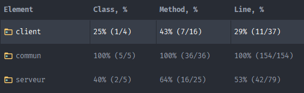

# Bilan livraison 1

## Les fonctionnalités proposées:
- Deux joueurs peuvent se connecter à une partie et jouer. 
- La partie ne commence que lorsque que les deux joueurs sont connectés. 
- Il y a deux tours dans une partie et le programme se termine 
(Le programme serveur se termine et envoie une requête aux joueurs pour que leur programme puisse se terminer)
- Les joueurs jouent des mots vides.  

Nous avons également créé, même s'ils ne sont pas encore totalement utilisés : 
  - Le plateau, 
  - les cases, 
  - les mots, 
  - les lettres, 
  - le joueur 
  - l'identification du joueur pour se connecter à la partie.

## L’organisation du code:
Le code est organisé en 3 modules : 
- le module client 
- le module commun (contient toutes les classes utilisées par le client et le serveur)
- le module serveur

## L'organisation des chemins (des web services):

### Côté client:
- ```/jouer``` : Le serveur demande au client de jouer. Et le client retourne un mot au serveur.
- ```/finir``` : Le serveur avertit le client que la partie est terminée.

### Côté Serveur:
- ```/Connexion``` : Le client se connecte au serveur en envoyant son Identification (nom et url). et le serveur retourne l'état de la connexion au client.

## Les tests effectués:
Tous les tests unitaires des classes pouvant faire l'objet de tests unitaires : 
- la classe joueur (package client)
- la classe case (package commun)
- la classe identification (package commun)
- la classe lettre (package commun)
- la classe mot (package commun)
- la classe plateau (package commun)
- la classe statistiques (package serveur)
- la classe joueur (package serveur)


